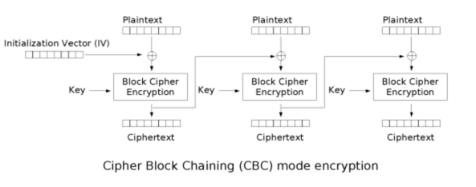

---
nav:
  title: 引擎
  order: 2
group:
  title: 安全
  order: 3
title: 加密
order: 1
---

# 加密

1. 摘要（hash）、基于摘要的消息验证码（HMAC）
2. 对称加密、非对称加密、电子签名
3. 分组加密模式

## 摘要 Hash

摘要（digest）：将长度不固定的消息作为输入，通过运行 hash 函数，生成固定长度的输出，这段输出就叫做摘要。通常用来验证消息完整、未被篡改。

摘要运算是不可逆的。也就是说，输入固定的情况下，产生固定的输出。但指导输出的情况下，无法反推出输入。

```
digest = Hash(message)
```

常见的摘要算法与对应的输出位数如下：

- MD5：128 位
- SHA-1：160 位
- SHA256：256 位
- SHA512：512 位

🌰 **示例：**

```js
const crypto = require('crypto');
const md5 = crypto.createHash('md5');

const message = 'hello';
const digest = md5.update(message, 'utf-8').digest('hex');

console.log(digest);
// 输出如下：注意这里是 16 进制
//
```

## 消息鉴定码

MAC（Message Authentication Code）：消息认证码，用以保证数据的完整性。运算结果取决于消息本身、密钥。

MAC 可以有多种不同的实现方式，比如 HMAC。

HMAC（Hash-based Message Authentication Code）：可以粗略地理解位带密钥的 hash 函数。

🌰 **示例：**

```js
const crypto = require('crypto');

// 参数一：摘要函数
// 参数二：秘钥
let hmac = crypto.createHmac('md5', '123456');

let ret = hmac.update('hello').digest('hex');

console.log(ret);
// 9c699d7af73a49247a239cb0dd2f8139
```

## 加密方案

加密/解密：给定明文，通过一定的算法，产生加密后的密文，这个过程叫加密。反过来就是解密。

```js
encryptedText = encrypt( plainText ) plainText = decrypt( encryptedText )
```

秘钥：为了进一步增强加/解密算法的安全性，在加/解密的过程中引入了秘钥。秘钥可以视为加/解密算法的参数，在已知密文的情况下，如果不知道解密所用的秘钥，则无法将密文解开。

```js
encryptedText = encrypt(plainText, encryptKey) plainText = decrypt(encryptedText, decryptKey)
```

根据加密、解密所用的秘钥是否相同，可以将加密算法分为对称加密、非对称加密。

### 对称加密

加密、解密所用的密钥是相同的，即 `encryptKey === decryptKey`。

常见的对称加密算法：DES、3DES、AES、Blowfish、RC5、IDEA。

🌰 **示例：**加解密

```js
// 加密
const encryptedText = encrypt(plainText, key);

// 解密
const plainText = decrypt(encryptedText, key);
```

### 非对称加密

又称公开秘钥加密。加密、解密所用的秘钥是不同的，即 `encryptKey !== decryptKey`。

加密秘钥公开，称为公钥。解密秘钥保密，称为秘钥。

常见的非对称加密算法：RSA、DSA、ElGamal。

🌰 **示例：**

```js
// 加密
const encryptedText = encrypt(plaintText, publicKey);

// 解密
const plainText = decrypt(encryptedText, priviteKey);
```

### 对比与应用

除了秘钥的差异，还有运算速度上的差异。通常来说：

1. 对称加密速度要快于非对称加密。
2. 非对称加密通常用于加密短文本，对称加密通常用于加密长文本。

两者可以结合起来使用，比如 HTTPS 协议，可以在握手阶段，通过 RSA 来交换生成对称秘钥。在之后的通讯阶段，可以使用对称加密算法对数据进行加密，秘钥则是握手阶段生成的。

## 数字签名

从**签名**大致可以猜到数字签名的用途。主要作用如下：

1. 确认信息来源于特定的主体
2. 确认信息完整、未被篡改

为了达到上述目的，需要有两个过程：

1. 发送方：生成签名
2. 接收方：验证签名

### 发送方生成签名

1. 计算原始信息的摘要
2. 通过私钥对摘要进行签名，得到电子签名
3. 将原始信息、电子签名，发送给接收方

🌰 **示例：**

```js
// 计算摘要
const digest = hash(message);

// 计算数字签名
const digitalSignature = sign(digest, priviteKey);
```

### 接收方验证签名

1. 通过公钥解开电子签名，得到摘要 D1。（如果解不开，信息来源主体校验失败）
2. 计算原始信息的摘要 D2。
3. 对比 D1、D2，如果 D1 等于 D2，说明原始信息完整、未被篡改。

### 对比非对称加密

由于 RSA 算法的特殊性，加密/解密、签名/验证 看上去特别像，很多同学都很容易混淆。先记住下面结论，后面有时间再详细介绍。

1. 加密/解密：公钥加密，私钥解密。
2. 签名/验证：私钥签名，公钥验证。

## 分组加密模式

常见的对称加密算法，如 AES、DES 都采用了分组加密模式。这其中，有三个关键的概念需要掌握：模式、填充、初始化向量。
搞清楚这三点，才会知道 crypto 模块对称加密 API 的参数代表什么含义，出了错知道如何去排查。

所谓的分组加密，就是将（较长的）明文拆分成固定长度的块，然后对拆分的快按照特定的模式进行加密。

常见的分组加密模式：ECB（不安全）、CBC（最常用）、CFB、OFB、CTR 等

以最简单的 ECB 为例，先将消息拆分成等分的模块，然后利用密钥进行加密。



### 初始化向量

为了增强算法的安全性，部分分组加密模式（CFB、OFB、CTR）中引入了初始化向量（IV），使得加密的结果随机化。也就是说，对于同一段明文，IV 不同，加密的结果不同。

以 CBC 为例，每一个数据块，都与前一个加密块进行亦或运算后，再进行加密。对于第一个数据块，则是与 IV 进行亦或。

IV 的大小跟数据块的大小有关（128 位），跟秘钥的长度无关。

### 填充

分组加密模式需要对长度固定的块进行加密。分组拆分完后，最后一个数据块长度可能小于 128 位，此时需要进行填充以满足长度要求。

填充方式有多重。常见的填充方式有 PKCS7。

假设分组长度为 k 字节，最后一个分组长度为 k-last，可以看到：

1. 不管明文长度是多少，加密之前都会会对明文进行填充 （不然解密函数无法区分最后一个分组是否被填充了，因为存在最后一个分组长度刚好等于 k 的情况）
2. 如果最后一个分组长度等于 k-last === k，那么填充内容为一个完整的分组 k k k ... k （k 个字节）
3. 如果最后一个分组长度小于 k-last < k，那么填充内容为 k-last mod k

```
            01 -- if lth mod k = k-1
        02 02 -- if lth mod k = k-2
            .
            .
            .
k k ... k k -- if lth mod k = 0
```

**概括来说**

1. 分组加密：先将明文切分成固定长度的块（128 位），再进行加密。
2. 分组加密的几种模式：ECB（不安全）、CBC（最常用）、CFB、OFB、CTR。
3. 填充（padding）：部分加密模式，当最后一个块的长度小于 128 位时，需要通过特定的方式进行填充。（ECB、CBC 需要填充，CFB、OFB、CTR 不需要填充）
4. 初始化向量（IV）：部分加密模式（CFB、OFB、CTR）会将 明文块 与 前一个密文块进行亦或操作。对于第一个明文块，不存在前一个密文块，因此需要提供初始化向量 IV（把 IV 当做第一个明文块 之前的 密文块）。此外，IV 也可以让加密结果随机化。
