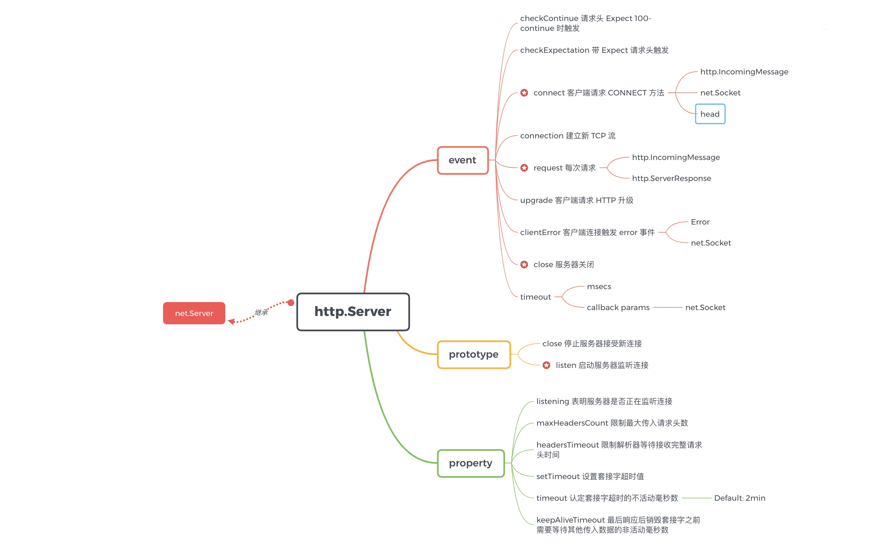

---
nav:
  title: 网络
  order: 4
group:
  title: HTTP
  order: 5
title: HTTP Server
order: 2
---

# HTTP Server

`http.Server` 通过 `http.createServer` 工厂方法创建，并继承自 `net.Server`。

## 监听事件

| 事件             | 描述                                                         |
| ---------------- | ------------------------------------------------------------ |
| checkContinue    | 遇 `Expect: 100 continue` 请求时触发                         |
| checkExpectation | 遇 `Expect` 请求头时触发                                     |
| connect          | 当客户端的 HTTP 请求方法为 CONNECT 方法时触发                |
| connection       | 当 TCP 连接建立时触发，大部分时候可以忽略这个事件。此外，可以通过 `req.connection` 来获取这个 Socket（从 Node.js 源码来看，`req.socket` 和 `req.socket` 都指向了这个 socket）。此外，socket 上的 readable 事件不会触发 |
| request          | 每次请求触发                                                 |
| upgrade          | 客户端请求 HTTP 升级时触发                                   |
| clientError      | 客户端连接异常                                               |
| close            | 关闭服务器                                                   |

## 配置属性

| 配置属性                | 说明                                                                                   | 默认值(ms) |
| ----------------------- | -------------------------------------------------------------------------------------- | ---------- |
| server.listening        | 表明服务器是否正在监听连接。                                                           |            |
| server.maxHeadersCount  | 限制最大传入请求头数。 如果设置为 0，则不会应用任何限制。                              | 2000       |
| server.headersTimeout   | 限制解析器等待接收完整 HTTP 请求头的时间。                                             | 120000     |
| server.timeout          | 认定套接字超时的不活动毫秒数。                                                         | 120000     |
| server.keepAliveTimeout | 服务器在完成写入最后一个响应之后，在销毁套接字之前需要等待其他传入数据的非活动毫秒数。 | 5000       |

