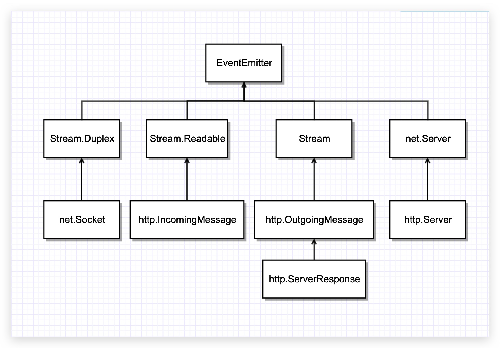

---
nav:
  title: 网络
  order: 4
group:
  title: HTTP
  order: 5
title: HTTP
order: 1
---

# HTTP

Node 的 http 模块包含对 HTTP 处理的封装。在 Node 中，HTTP 服务继承自 TCP 服务器（[net 模块](./net.md)），它能够与多个客户端保持连接，由于其采用事件驱动的形式，并不为每一个连接创建额外的线程或进程，保持很低的内存占用，所以能实现高并发。HTTP 服务与 TCP 服务模型有区别的地方在于，在开启 keepalive 后，一个 TCP 会话可以用于多次请求和响应。TCP 服务以 connection 为单位进行服务，HTTP 服务以 request 为单位进行服务。http 模块即是将 connection 到 request 的过程进行了封装。

Node.js 采用的网络请求处理模型是 I/O 多路复用，与传统的主从多线程并发模型区别：

- 只使用有限的线程数（1 个），所以占用系统资源很少
- 操作系统级的异步 I/O 支持，可以减少用户态/内核态切换，并且本身性能更高（因为直接与网卡驱动交互）
- JavaScript 天生具有保护程序执行现场的能力（闭包），传统模型要么依赖应用程序自己保存现场，或者依赖线程切换时自动完成

## http.createServer

通过 `http.createServer` 工厂方法可以创建一个 HTTP 服务器，返回 `http.Server` 对象实例，该实例继承自 `net.Server`。

```js
http.createServer([requestListener]);
```

事实上，HTTP 协议确实是基于 TCP 协议实现的。

craeteServer 的可选参数 requestListener 用于监听 request 事件；另外，它也监听 connection 事件，只不过回调函数是 `http.Server` 自己实现的。然后调用 listen 让 `http.Server` 对象在端口 3333 上监听连接请求并最终创建 TCP 对象，由 `tcp_wrap.h` 实现。最后会调用 TCP 对象的 listen 方法，这才是真正在指定端口开始提供服务。



涉及到 C++的类大多是对 libuv 做了一层包装并公布给 JavaScript，所以不在这里特别列出。我们有必要提 `http-parser`，它是用来解析 HTTP 请求/响应消息的，本身十分高效：没有任何系统调用，没有内存分配操作，纯 C 实现。

## 发送请求

http 模块可以通过 `get` 和 `request` 方法发送 HTTP 请求。

### http.get

`http.get` 方法主要用于发出 GET 请求。

由于大多数请求都是没有主体的 GET 请求，所以 Node.js 提供了这个便捷的方法。

```js
http.get(options[, callback])

http.get(url[,options][,callback])
```

这个方法与 `http.request` 方法的区别在于，它将方法设置为 GET 并自动调用 `req.end()`。

`callback` 调用时只有一个参数，该参数是 [http.IncomingMessage](http-incoming-message.md) 的实例。


### http.request

```js
http.request(options[, callback])

http.request(url[, options][, callback])
```

配置对象 options 属性：

| 属性             | 说明                                              | 默认值        |
| ---------------- | ------------------------------------------------- | ------------- |
| protocol         | 使用协议                                          | `'http'`      |
| host             | 请求发送至的服务器的域名或 IP 地址                | `'localhost'` |
| hostname         | host 的别名                                       |               |
| family           | IP 地址族（有效值为 4 或 6）                      |               |
| port             | 远程服务器的端口                                  | 80            |
| localAddress     | 为网络连接绑定的本地接口                          |               |
| socketPath       | Unix 域套接字                                     |               |
| method           | HTTP 请求方法                                     | `'GET'`       |
| path             | 请求路径                                          | `'/'`         |
| headers          | 包含请求头的对象                                  |               |
| auth             | 基本的身份验证                                    |               |
| agent            | 控制 Agent 的行为                                 |               |
| createConnection | 当 agent 未使用时，用来为请求生成套接字或流的函数 |               |
| timeout          | 指定套接字超时的数值                              |               |
| setHost          | 是否自动添加 Host 请求头                          | true          |

参数 `url` 可以是字符串或 URL 对象。

* 如果是字符串，则会自动使用 `url.parse()` 解析
* 如果是 URL 对象，则会自动转换为普通的 `options` 对象

如果同时制定了 `url` 和 `options`，则对象会被合并，其中 `options` 属性优先。

可选的 `callback` 参数会作为单次监听器被添加到 `response` 事件中。

`http.request()` 放回 [http.ClientRequest](http-client-request.md) 类的实例。ClientRequest 实例是一个可写流。如果需要时哟功能 POST 请求上传文件，则写入 ClientRequest 对象。

## HTTP 类


- `http.Agent`：负责管理 HTTP 客户端的连接持久性和重用
- `http.ClientRequest`：用于向服务端发起请求，由 `http.request` 内部创建并返回，表示正在进行的请求，且其请求头已进入队列
- `http.Server`：用于提供 HTTP 服务，处理客户端的请求
- `http.ServerResponse`：由 HTTP 服务器在内部创建，而不是由用户创建
- `http.IncomingMessage`：用于访问响应状态、消息头以及数据

### http.ClientRequest

HTTP 客户端

```js
const http = require('http');

const client = http.get('http://127.0.0.1:3000', function(request) {
  request.pipe(process.stdout);
});
```

`http.ClientRequest` 内部创建了一个 Socket 来发起请求。

当你调用 `http.request(options)` 时，内部是这样的。

```js
self.onSocket(net.createConnection(options));
```

### http.Server

Web 服务器

```js
const http = require('http');

const server = http.createServer(function(request, response) {
  const pathname = request.url;
});
```

- `http.Server` 继承了 `net.Server`
- `net.createServer(fn)` 回调中的 `socket` 是个双工的 `stream` 接口，也就是说，读取发送方信息、向发送方发送信息都靠它实现

🌰 **标准示例：**

```js
// 参考：https://cnodejs.org/topic/4fb1c1fd1975fe1e1310490b
var net = require('net');

var PORT = 8989;
var HOST = '127.0.0.1';

var server = net.createServer(function(socket) {
  console.log('Connected: ' + socket.remoteAddress + ':' + socket.remotePort);

  socket.on('data', function(data) {
    console.log('DATA ' + socket.remoteAddress + ': ' + data);
    console.log('Data is: ' + data);

    socket.write('Data from you is  "' + data + '"');
  });

  socket.on('close', function() {
    console.log('CLOSED: ' + socket.remoteAddress + ' ' + socket.remotePort);
  });
});
server.listen(PORT, HOST);

console.log(server instanceof net.Server); // true
```

### http.IncomingMessage

[http.IncomingMessage](https://github.com/nodejs/node/blob/master/lib/_http_incoming.js)

获取请求方发送的信息，比如：请求方法、路径、传递的数据等。

- 在 Server 端和 Client 端都会出现

三个需要注意的属性：

- method：只在 Server 端实例中有
- statusCode：只在 Client 端实例中有
- statusMessage：只在 Client 端实例中有

### http.ServerResponse

实现了 Writable Stream interface，内部也是通过 Socket 来发送信息。

---

**参考资料：**

- [走进 Node.js 之 HTTP 实现分析](https://juejin.im/post/5965bb26f265da6c204195b3)
