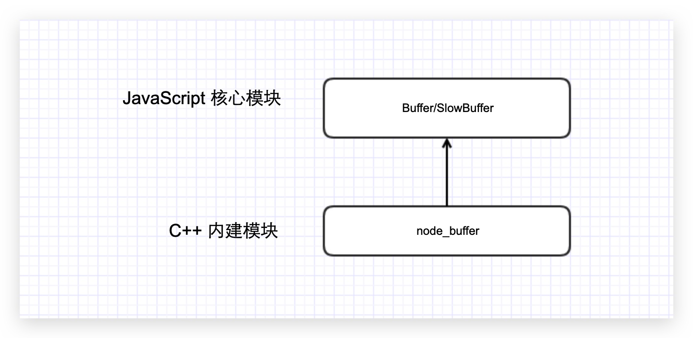

---
nav:
  title: 系统
  order: 3
group:
  title: 异步 I/O
  order: 2
title: Buffer 缓冲器
order: 2
---

# Buffer 缓冲器

Buffer 是 Node.js 的核心模块，开发者可以利用它来处理二进制数据，比如文件流的读写、网络请求数据的处理等。

Buffer 实例一般用于表示编码字符的序列，比如 UTF-8、UCS2、Base64 或十六进制编码的数据。通过使用显式的字符编码，就可以在 Buffer 实例与普通的 JavaScript 字符串之间进行相互转换。

[Node.js Buffer 文档](https://www.nodejs.red/#/nodejs/buffer)

## 基本概念

### 二进制数据

二进制数据使用 0 和 1 两个数码来表示的数据，为了存储或展示一些数据，计算机需要先将这些数据转换为二进制来表示。例如，我想存储 66 这个数字，计算机会先将数字 66 转化为二进制 01000010 表示，转换公式如下所示：

| 128 | 64  | 32  | 16  | 8   | 4   | 2   | 1   |
| :-- | :-- | :-- | :-- | :-- | :-- | :-- | :-- |
| 0   | 1   | 0   | 0   | 0   | 0   | 1   | 0   |

除了数字类型，还有字符串、图像、文件等需要使用二进制表示。例如我们对一个英文字母 M 操作，在 JavaScript 中可以通过 `'M'.charCodeAt()` 取到对应的 ASCII 码之后（通过以上的步骤）会转为二进制表示。

### Stream

流，英文 Stream 是对输入输出设备的抽象，这里的设备可以是文件、网络、内存等。

流是有方向性的，当程序从某个数据源读入数据，会开启一个输入流，这里的数据源可以是文件或者网络等，例如我们从 `a.txt` 文件读入数据。相反的当我们的程序需要写出数据到指定数据源（文件、网络等）时，则开启一个输出流。当有一些大文件操作时，我们就需要 Stream 像管道一样，一点一点的将数据流出。

例如我们需要将一池水浇灌一片菜地，如果我们需要将这池水全部倒入菜地，首先需要这么大的力气（这里好比计算机中的硬件性能）才能搬得动。如果，我们拿来了水管将水一点一点流入我们的菜地，这个事后不要这么大力气就可以完成。

### Buffer

了解 Stream 后，我们知道数据是从一端流向另一端，那么他们是怎样流动的呢？

通常，数据的移动是为了处理或者读取它，并根据它进行决策。伴随着事件的推移，每一个过程都会有一个最小或最大数据量。如果数据到达的速度比进程消耗得速度快，那么少数早到达的数据会处于等待去等待被处理。反之，如果数据到达的速度比进程消耗的数据慢，那么早先到达的数据需要等待一定量的数据到达之后才能被处理。

这里的等待区指的就是缓冲区（Buffer），它是计算机中的一个小物理单位，通常位于计算机的 RAM 中。

## Buffer 结构

Buffer 是一个类似 Array 的对象，但它主要用于操作字节。

下面从**模块结构**和**对象结构**的层面来认识 Buffer。

### 模块结构

Buffer 是典型的 JavaScript 与 C++ 结合的模块，它将性能相关部分用 C++ 实现，将非性能相关的部分用 JavaScript 实现。



Buffer 所占的内存不是通过 V8 分配的，属于堆外内存。由于 V8 垃圾回收性能的影响，将常用的操作对象用更高效和专有的内存分配回收策略来管理是个不错的思路。

由于 Buffer 太多常见，Node 在进程启动时就已经加载了它，并将其放在全局对象（`global`）上。所以在使用 Buffer 时，无须通过 `require()` 即可直接使用。

### 对象结构

Buffer 对象类似于数组，它的元素为 16 进制的两位数，即 0 到 255 的数值。

🌰 **示例：**

```js
const str = '缓冲器';
const buf = Buffer.from(str, 'utf-8');

console.log(buf);
// => <Buffer e7 bc 93 e5 86 b2 e5 99 a8>
```

从上述例子可见，不同编码的字符串占用的元素个数各不相同，上面代码中的中文字在 UTF-8 编码下占用 3 个元素，字母和半角标号占用 1 个元素。

Buffer 受 Array 类型的影响很大，可以访问 `length` 属性得到长度，也可以通过下标访问元素，在构造对象时也十分相似。

如果元素赋值不是 0 至 255 之间的整数而是小数时，分两种情况：

- 给元素的赋值小于 0， 就将该值逐次加 256，直到得到一个 0 到 255 之间的整数
- 如果得到的数值大于 255，就逐次减 256，直到得到 0 ～ 255 区间内的数值
- 如果是小数，只保留整数部分

## Buffer 内存机制

Buffer 对象的内存分配不是在 V8 的堆内存中，而是在 Node 的 C++ 层面实现内存的申请的。因为处理大量的字节数据不能采用需要一点内存就向操作系统申请一点内存的方式，这可能造成大量的内存申请的系统调用，对操作系统有一定压力。为此 Node 在内存的使用上应用的是在 C++ 层面申请内存、在 JavaScript 中分配内存的策略。因此，这部分内存我们称之为**堆外内存**。

### Buffer 内存分配原理

为了高效使用申请来的内存，Node.js 采用了 slab 机制进行预先申请、事后分配，是一种动态的管理机制。

使用 `Buffer.alloc(size)` 传入一个指定的 `size` 就会申请一块固定大小的内存区域，slab 具有如下三种状态：

- `full`：完全分配状态
- `partial`：部分分配状态
- `empty`：没有被分配状态

当我们需要一个 Buffer 对象，可以通过以下方式分配指定大小的 Buffer 对象：

```js
Buffer(size);
```

Node.js 以 8KB 为界限来区分是小对象还是大对象：

```js
Buffer.poolSize = 8 * 1024; // 102 行，Node.js 版本为 v10.x
```

这个 8KB 的值也就是每个 slab 的大小值，在 JavaScript 层面，以它作为单位单元进行内存的分配。

> Buffer 在创建时大小已经被确定且是无法调整的。

#### 分配小 Buffer 对象

如果指定 Buffer 的大小少于 8 KB，Node 会按照小对象的方式进行分配。Buffer 的分配过程中主要使用一个局部变量 `pool` 作为中间处理对象，处于分配状态的 `slab` 单元都指向它。以下是分配一个全新的 slab 单元的操作，它将会新申请的 SlowBuffer 对象指向它：

```js
var pool;

function allocPool() {
  pool = new SlowBuffer(Buffer.poolSize);
  pool.used = 0;
}
```


现在让我们尝试分配一个大小为 2048 的 Buffer 对象：

```js
Buffer.alloc(2 * 1024);
```

我们看看当前的 slab 单元内存是怎样的：


那么这个分配过程是怎样的呢？让我们看看 buffer.js 另外一个核心的方法 `allocate(size)`。

```js
// https://github.com/nodejs/node/blob/v10.x/lib/buffer.js#L318
function allocate(size) {
  if (size <= 0) {
    return new FastBuffer();
  }

  // 当分配的空间小于 Buffer.poolSize 向右移位，这里得出来的结果为 4KB
  if (size < Buffer.poolSize >>> 1) {
    if (size > poolSize - poolOffset) createPool();
    var b = new FastBuffer(allocPool, poolOffset, size);
    poolOffset += size; // 已使用空间累加
    alignPool(); // 8 字节内存对齐处理
    return b;
  } else {
    // C++ 层面申请
    return createUnsafeBuffer(size);
  }
}
```

这时候的 slab 状态为 partial（部分分配状态）。

当再次创建 Buffer 对象时，构造过程中将会判断这个 slab 的剩余空间是否足够。如果足够，使用剩余空间，并更新 slab 的分配状态。

如果 slab 的剩余空间不够，将会构造新的 slab，原 slab 中剩余的空间会造成浪费。例如，第一次构造 1 字节的 Buffer 对象，第二次构造 8192 字节的 Buffer 对象，由于第二次分配时 slab 中的空间不够，所以会创建并使用新的 slab，第一个 slab 的 8KB 将会被第一个 1 字节的 Buffer 对象独占。

这里要注意的是，因为同一个 slab 可能分配给多个 Buffer 对象使用，只有这些小 Buffer 对象在作用域释放并都可以回收时，slab 的 8KB 空间才会被回收。尽管创建了 1 个字节的 Buffer 对象，但是如果不是放它，实际可能是 8KB 的内存没有释放。

#### 分配大 Buffer 对象

如果需要超过 8KB 的 Buffer 对象，将会直接分配一个 SlowBuffer 对象作为 slab 单元，这个 slab 单元将会被这个大 Buffer 对象独占。

```js
// Big Buffer，just alloc one
this.parent = new SlowBuffer(this.length);
this.offset = 0;
```

这里的 SlowBuffer 类是在 C++ 中定义的，虽然引用 buffer 模块可以访问到它，但是不推荐直接操作它，而是用 Buffer 替代。

上面提到的 Buffer 对象都是 JavaScript 层面的，能够被 V8 的垃圾回收标记回收。但是其内部的 `parent` 属性指向的 SlowBuffer 对象却来自于 Node 自身 C++ 定义，是 C++ 层面上的 Buffer 对象，所用内存不在 V8 的堆中。

#### 内存分配总结

1. 在初次加载时就会初始化 1 个 8KB 的内存空间，`buffer.js` 源码有提现
2. 根据申请的内存大小分为 **小 Buffer 对象** 和 **大 Buffer 对象**
3. 小 Buffer 情况，会继续判断这个 slab 空间是否足够

- 如果空间足够就去使用剩余空间同时更新 slab 分配壮体啊，偏移量会增加
- 如果空间不足，slab 空间不足，就会去创建一个新的 slab 空间用来分配

4. 大 Buffer 情况，则会直接走 `creatUnsafeBuffer(size)` 函数
5. 不论是小 Buffer 对象还是大 Buffer 对象，内存分配是在 C++ 层面完成，内存管理在 JavaScript 层面，最终还是可以被 V8 的垃圾回收标记所回收

## 使用方法

### 实例化方式

在 Node.js v6 之前都是通过调用构造函数的方式实例化 Buffer，根据参数返回不同结果。处于安全性原因，这种方式在 v6 后的版本中已经被废除，提供了：

- `Buffer.from()`
- `Buffer.alloc()`
- `Buffer.allocUnsafe()`

三个单独的，职责清晰的函数处理实例化 Buffer 的工作。

- `Buffer.from(array)`：返回一个内容包含所提供的字节副本的 Buffer，数组中每项是一个表示八位字节的数字，所以值必须在 0~255 之间，否则会取模
- `Buffer.from(arrayBuffer)`：返回一个与给定的 ArrayBuffer 共享内存的新 Buffer
- `Buffer.from(buffer)`：返回给定 Buffer 的一个副本 Buffer
- `Buffer.from(string [, encoding])`：返回一个包含给定字符串的 Buffer
- `Buffer.alloc(size [, fill [, encoding]])`：返回指定大小并且已填充的 Buffer
- `Buffer.allocUnsafa(size)`：返回指定大小的 Buffer，内容必须用 `buf.fill(0)` 等方法填充

```js
// 0x 表示 16进制

Buffer.from([1, 2, 3]); // [0x1, 0x2, 0x3]

Buffer.from('test', 'utf-8'); // [0x74, 0x65, 0x73, 0x74]

Buffer.alloc(5, 1); // [0x1, 0x1, 0x1, 0x1, 0x1]

Buffer.allocUnsafe(5); // 值不确定，后面详谈
```

`Buffer.allocUnsafe()` 的执行会快于 `Buffer.alloc()`，看名字很不安全，确实也不安全。

当调用 `Buffer.allocUnsafe()` 时分配的内存段尚未初始化（不归零），这样分配内存速度很块，但分配到的内存片段可能包含旧数据。如果在使用的时候不覆盖这些旧数据就可能造成内存泄露，虽然速度快，尽量避免使用。

### 字符编码

通过使用字符编码，可实现 Buffer 实例与 JavaScript 字符串之间的相互转换，目前 Node.js 所支持的字符编码如下所示：

- `ascii`：仅适用于 7 位 ASCII 数据。此编码速度很快，如果设置则会剥离高位。
- `utf8`：多字节编码的 Unicode 字符。许多网页和其他文档格式都适用 UTF-8.
- `utf16le`：2 或 4 个字节，小端序编码的 Unicode 字符。支持代理对（U+10000 至 U+10FFFF）。
- `ucs2`：`utf16le` 的别名
- `base64`：Base64 编码。当从字符串创建 Buffer 时，此编码也会正确地接受 RFC 4648 第 5 节中指定的 URL 和文件名安全字母。
- `latin1`：一种将 Buffer 编码成单字节编码字符串的方法（由 RFC 1345 中的 IANA 定义，第 63 页，作为 Latin-1 的补充块和 CO/C1 控制码）
- `binary`：`latin1` 的别名
- `hex`：将每个字节编码成两个十六进制的字符

```js
const buf = Buffer.from('Hello world!', 'ascii');
console.log(buf.toString('hex')); // 68656c6c6f20776f726c64
```

### 类型转换

关于 Buffer 的类型转换有两种：

- 字符串转 Buffer
- Buffer 转字符串

#### 字符串转 Buffer

这个相信不会陌生，通过上面讲解的 `Buffer.from()` 实现，如果不传递 `encoding` 默认按照 UTF-8 格式转换存储。

```js
const buf = Buffer.from('Hello world!', 'UTF-8');

console.log(buf); // <Buffer 48 65 6c 6c 6f 20 77 6f 72 6c 64 21>
console.log(buf.length); // 12
```

#### Buffer 转字符串

Buffer 转字符串也很简单，使用 `toString([encoding], [start], [end])` 方法，默认编码仍为 UTF-8，如果不传 `start`、`end` 可实现全部转换，传了 `start`、`end` 可实现部分转换。

```js
const buf = Buffer.from('Hello world!', 'UTF-8');

console.log(buf); // <Buffer 48 65 6c 6c 6f 20 77 6f 72 6c 64 21>
console.log(buf.length); // 12
console.log(buf.toString('UTF-8', 0, 9)); // Hello wor
```

#### StringDecoder

在 Node 中一个汉字由三个字节表示，如果我们处理中文字符的时候使用了不是 3 的背书的字节数就会造成字符拼接乱码的问题。

```js
const buf = Buffer.from('中文字符串！');

for (let i = 0; i < buf.length; i += 5) {
  var b = Buffer.allocUnsafe(5);
  buf.copy(b, 0, i);
  console.log(b.toString());
}
```

通过 `string_decoder` 模块可以解决这个问题：

```js
const StringDecoder = require('string_decoder').StringDecoder;
const decoder = new StringDecoder('utf-8');

const buf = Buffer.from('中文字符串！');

for (let i = 0; i < buf.length; i += 5) {
  var b = Buffer.allocUnsafe(5);
  buf.copy(b, 0, i);
  console.log(decoder.write(b));
}
```

StringDecoder 在得到编码后，直到宽字节在 UTF-8 下占 3 个字节，所以在处理末尾不全的字节时，会保留到第二次 `write()`。目前只能处理 UTF-8、Base64 和 UCS-2/UTF-16LE。

## Buffer 应用场景

由于应用场景不同，在 Node 中，应用需要处理网络协议、操作数据库、处理图片、接收上传文件等，在网络流和文件的操作中，还要处理大量二进制数据，JavaScript 自有的字符串远远不能满足这些需求，于是 Buffer 对象应运而生。

## I/O 操作

关于 I/O 可以是文件或网络 I/O，以下为通过流的方式将 input.txt 的信息读取出来之后写入到 output.txt 文件。

```js
const fs = require('fs');

const inputStream = fs.creatReadStream('input.txt'); // 创建可读流
const outputStream = fs.creatWriteStream('output.txt'); // 创建可写流

inputStream.pipe(outputStream); // 管道读写
```

在 Stream 中我们是不需要手动去创建自己的缓冲区，在 Node.js 的流中将会自动创建。

## 加解密

在一些加解密算法中会遇到使用 Buffer，例如 `crypto.createCipheriv` 的第二个参数 `key` 为 String 或 Buffer 类型，如果是 Buffer 类型，就用到了本篇我们讲解的内容，以下做了一个简单的加密示例，重点使用了 `Buffer.alloc()` 初始化一个实例（这个上面有介绍），之后使用了 `fill` 方法做了填充，这里重点在看下这个方法的使用。

`buf.fill(value [, offset [, end]][, encoding])`

- `value`：第一个参数为要填充的内容
- `offset`：偏移量，填充的起始位置
- `end`：结束填充 buf 的偏移量
- `encoding`：编码集

以下为 Cipher 的堆成加密 Demo：

```js
const crypto = require('crypto');
const [key, iv, algorithm, encoding, cipherEncoding] = [
  'a123456789',
  '',
  'aes-128-ecb',
  'utf8',
  'base64',
];

const handleKey = key => {
  const bytes = Buffer.alloc(16); // 初始化一个 Buffer 实例，每一项都用 00 填充
  console.log(bytes); // <Buffer 00 00 00 00 00 00 00 00 00 00 00 00 00 00 00 00>

  bytes.fill(key, 0, 10); // 填充
  console.log(bytes); // <Buffer 61 31 32 33 34 35 36 37 38 39 00 00 00 00 00 00>

  return bytes;
};

let cipher = crypto.createCipheriv(algorithm, handleKey(key), iv);
let crypted = cipher.update('Node.js 技术栈', encoding, cipherEncoding);
crypted += cipher.final(cipherEncoding);

console.log(crypted); // jE0ODwuKN6iaKFKqd3RF4xFZkOpasy8WfIDl8tRC5t0=
```

## Buffer VS Cache

缓冲（Buffer）与缓存（Cache）的区别？

### 缓冲（Buffer）

缓冲（Buffer）是用于处理二进制流数据，将数据缓冲起来，它是临时性的，对于流式数据，会采用缓冲区将数据临时存储起来，等缓冲到一定的大小之后在存入硬盘中。视频播放器就是一个经典的例子，有时你会看到一个缓冲的图标，这意味着此时这一组缓冲区并未填满，当数据到达填满缓冲区并且被处理之后，此时缓冲图标消失，你可以看到一些图像数据。

### 缓存（Cache）

缓存（Cache）我们可以看作是一个中间层，它可以是永久性的将热点数据进行缓存，使得访问速度更快，例如我们通过 Memory、Redis 等将数据从硬盘或其它第三方接口中请求过来进行缓存，目的就是将数据存于内存的缓存区中，这样对同一个资源进行访问，速度会更快，也是性能优化一个重要的点。

来自知乎的一个讨论，详情查阅 [Cache 和 Buffer 都是缓存，主要区别是什么？](https://www.zhihu.com/question/26190832)

## Buffer VS String

通过压力测试来看看 String 和 Buffer 两者的性能如何？

```js
const http = require('http');
let s = '';
for (let i = 0; i < 1024 * 10; i++) {
  s += 'a';
}

const str = s;
const bufStr = Buffer.from(s);
const server = http.createServer((req, res) => {
  console.log(req.url);

  if (req.url === '/buffer') {
    res.end(bufStr);
  } else if (req.url === '/string') {
    res.end(str);
  }
});

server.listen(3000);
```

以上实例我放在虚拟机里进行测试，你也可以在本地电脑测试，使用 AB 测试工具。

---

**参考资料：**

- [📝 Node.js 中的缓冲区（Buffer）究竟是什么？](https://www.nodejs.red/#/nodejs/buffer)
- [Node JS stream 一：Buffer](https://zhuanlan.zhihu.com/p/24429470)
- [探究不再 V8 堆内存中存储的 Buffer 对象](https://juejin.im/post/5d2db6d9f265da1bcc1975d7)
