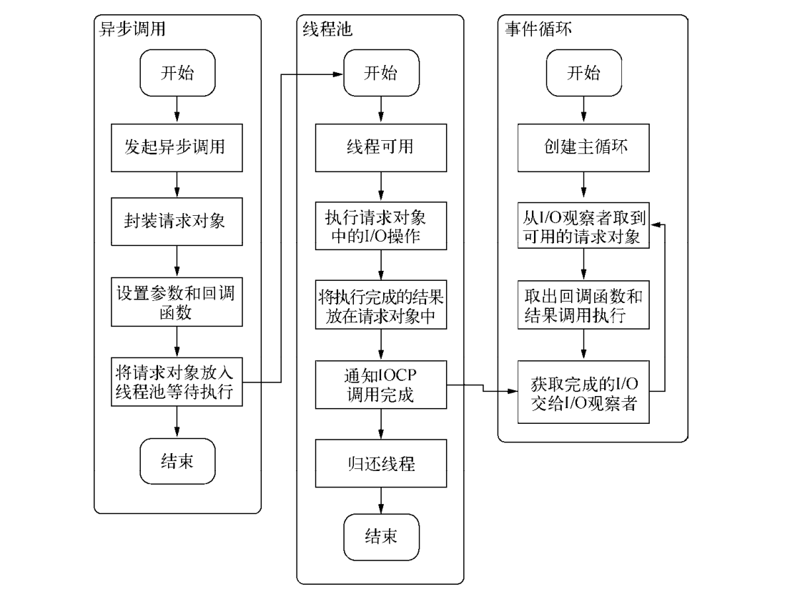

---
nav:
  title: 系统
  order: 3
group:
  title: 异步 I/O
  order: 2
title: 概述
order: 1
---

# I/O

**I/O**（Input/Output，输入/输出）即数据的读取（接收）或写入（发送）操作，通常用户进程中的一个完整 I/O 分为两个阶段：

* `用户进程空间 <-> 内核空间`
* `内核空间 <-> 设备空间`（磁盘、网络等）。

I/O 有**内存 I/O**、**网络 I/O** 和**磁盘 I/O** 三种，通常我们说的 I/O 指的是后两者。

Linux 中进程无法直接操作 I/O 设备，其必须通过系统调用请求 Kernel 来协助完成 I/O 动作；内核会为每个 I/O 设备维护一个**缓冲区**。

对于一个输入操作来说，进程 I/O 系统调用后，内核会先看缓冲区中有没有相应的缓存数据，没有的话再到设备中读取，因为设备 I/O 一般速度较慢，需要等待。内核缓冲区有数据则直接复制到进程空间。

所以，对于一个网络输入操作通常包括两个不同阶段：

1. 等待网络数据到达网卡 -> 读取到内核缓冲区，数据准备好
2. 从内核缓冲区复制数据到进程空间

以下伪代码模仿了一个从磁盘上获取文件和一个从网络中获取文件的操作。异步 I/O 的效果就是 `getFileFromNet` 的调用不依赖于 `getFile` 调用的结束。

```js
getFile('file_path');
getFileFromNet('url');
```

如果以上两个任务的时间分别为 `m` 和 `n`。采用同步方式的程序要完成这两个任务的时间总花销会是 `m + n`。但是如果是采用异步方式的程序，在两种 I/O 可以并行的状况下（比如网络 I/O 与文件 I/O），时间开销将会减小为 `max(m, n)`。

> 在 Node.js 中 I/O 主要指由 [libuv](http://libuv.org/) 支持的，与系统磁盘和网络之间的交互。

## 必要性

有的语言为了设计得使应用程序调用方便，将程序设计为同步 I/O 模型。这意味着程序中的后续任务都需要等待 I/O 的完成。在等待 I/O 完成的过程中，程序无法充分利用 CPU。为了充分利用 CPU，和使 I/O 可以并行，目前有两种方式可以达到目的：

- **多线程单进程**：多线程的设计之处就是为了**在共享的程序空间中，实现并行处理任务**，从而达到充分利用 CPU 的效果。多线程的缺点在于执行时上下文交换的开销较大，和状态同步（锁）的问题。同样它也使得程序的编写和调用复杂化。但是多线程在多核 CPU 上能够有效提升 CPU 的利用率，这个优势是毋庸置疑的。
- **单线程多进程**：单线程顺序执行任务的方式比较符合编程人员按顺序思考的思维方式。它依然是最主流的编程方式。但是串行执行的缺点在于性能，任意一个略慢的任务都会导致后续执行代码被阻塞。为了避免多线程造成的使用不便问题，有的语言选择了单线程保持调用简单化，采用启动多进程的方式来达到充分利用 CPU 和提升总体的并行处理能力。 它的缺点在于业务逻辑复杂时（涉及多个 I/O 调用），因为业务逻辑不能分布到多个进程之间，事务处理时长要远远大于多线程模式。

目前的大型 Web 应用中，单机的情形是十分稀少的，一个事务往往需要跨越网络几次才能完成最终处理。如果网络速度不够理想，`m` 和 `n` 值都将会变大，这时同步 I/O 的语言模型将会露出其最脆弱的状态。

这种场景下的异步 I/O 将会体现其优势，`max(m, n)` 的时间开销可以有效地缓解 `m` 和 `n` 值增长带来的性能问题。而当并行任务更多的时候，`m + n + …` 与 `max(m, n, …)` 之间的孰优孰劣更是一目了然。从这个公式中，可以了解到异步 I/O 在分布式环境中是多么重要，而 Node.js 天然地支持这种异步 I/O，这是众多云计算厂商对其青睐的根本原因。

### 用户体验

浏览器中 JavaScript 在单线程上执行，而且它还是与 UI 渲染共用一个线程的。这意味着 JavaScript 在执行的时候 UI 渲染和响应是处于停滞状态的。

### 资源分配

操作系统会将 CPU 的时间片分配给其余进程，以公平而有效地利用资源，基于这一点，有的服务器为了提升响应能力，会通过启动多个工作进程来为更多的用户服务。但是对于这一组任务而言，它无法分发任务到多个进程上，所以依然无法高效利用资源，结束所有任务所需的时间将会较长。这种模式类似于加三倍服务器，达到占用更多资源来提升服务速度，它并没有真正改善问题。

添加硬件资源是一种提升服务质量的方式，但它不是唯一的方式。

单线程同步编程模型会因阻塞 I/O 导致硬件资源得不到更优的使用。多线程编程模型也因为编程中的死锁、状态同步等问题让开发人员头疼。

Node 在两者之间给出了方法：利用单线程，远离多线程死锁、状态同步等问题；利用异步 I/O，让单线程远离阻塞，以更好地利使用 CPU。

为了弥补单线程无法利用多核 CPU 的缺点，Node 提供了类似前端浏览器中 Web Workers 的子进程，该子进程可以通过工作进程高效地了利用 CPU 和 I/O。

## 实现模型

操作系统对于 I/O 只有两种方式：阻塞与非阻塞。在调用阻塞 I/O 时，应用程序需要等待 I/O 完成才返回结果。

阻塞 I/O 的一个特点是调用之后一定要等到系统内核层面完成所有操作后，调用才结束。以读取磁盘上的一段文件为例，系统内核在完成磁盘寻道、读取数据、复制数据到内存中之后，这个调用才结束。

### 阻塞模型

<!--  -->

进程发起 I/O 系统调用后，进程被阻塞，转到内核空间处理，整个 I/O 处理完毕后返回进程。操作成功则进程获取到数据。

**典型应用：**

* 阻塞 Socket
* Java BIO

**特点：**

* 进程阻塞挂起不消耗 CPU 资源，及时响应每个操作
* 实现难度低、开发应用较容易
* 适用并发量小的网络应用开发

**缺点：**

* 不适用并发量大的应用：因为一个请求 I/O 会阻塞进程，所以，得为每请求分配一个处理进程（线程）以及时响应，系统开销大

### 非阻塞模型

<!--  -->

进程发起 I/O 系统调用后，如果内核缓冲区没有数据，需要到 I/O 设备中读取，进程返回一个错误而不会被阻塞；进程发起 I/O 系统调用后，如果内核缓冲区有数据，内核就会把数据返回进程。

对于上面的阻塞 I/O 模型来说，内核数据没准备好需要进程阻塞的时候，就返回一个错误，以使得进程不被阻塞。

**特点：**

* 进程轮询（重复）调用，消耗 CPU 的资源
* 实现难度低、开发应用相对阻塞 I/O 模式较难
* 使用并发量较小，且不需要及时响应的网络应用开发

### 复用模型

<!--  -->

多个进程的 I/O 可以注册到一个复用器（select）上，然后用一个进程调用该 select，select 会监听所有注册进来的 I/O。

如果 select 没有监听的 I/O 在内核缓冲区都没有可读数据，select 调用进程会被阻塞；而当任一 I/O 在内核缓冲区中有可读数据，select 调用就会返回。

多个进程注册 I/O 后，只有另一个 select 调用进程被阻塞。

**特点：**

* 专一进程解决多个进程 I/O 的阻塞问题，性能好
* 实现、开发应用难度较大
* 适用高并发服务应用开发：一个进程（线程）响应多个请求


### 信号驱动模型

<!--  -->

当进程发起一个 I/O 操作，会向内核注册一个信号处理函数，然后进程返回不阻塞；当内核数据就绪时会发送一个信号给进程，进程便在信号处理函数中调用 I/O 读取数据。

**特点：**

* 回调机制
* 实现、开发应用难度大

### 异步模型

<!--  -->

当进程发起一个 I/O 操作，进程返回（不阻塞），但也不能返回结果；内核把整个 I/O 处理完后，会通知进程结果。如果 I/O 操作成功则进程直接获取到数据。

**特点：**

* 不阻塞，数据一步到位：Proactor 模式
* 需要操作系统的底层支持，Linux 2.5 版本内核首现，2.6 版本产品的内核标准特性
* 实现、开发应用难度大
* 非常适合高性能高并发应用

## 模型比较

* **阻塞调用**：在用户进程（线程）中调用执行的时候，进程会等待该 I/O 操作，而使得其它操作无法执行
* **非阻塞调用**：在用户进程中调用执行的时候，无论成功与否，该 I/O 操作会立即返回，之后进程可以进行其它操作（当然如果是读取到数据，一般就接着进行数据处理）

进程（线程）I/O 调用会不会阻塞进程自己。所以这里两个概念是相对调用进程本身状态而言的。

阻塞 I/O 模型是一个阻塞 I/O 调用，而非阻塞 I/O 模型是多个非阻塞 I/O 调用 + 一个阻塞 I/O 调用，因为多个 I/O 检查会立即返回错误，不会阻塞进程。

### 阻塞和非阻塞

阻塞模式的 I/O 会造成应用程序等待，直到 I/O 完成。同时操作系统也支持将 I/O 操作设置为非阻塞模式，这时应用程序的调用将可能在没有拿到真正数据时就立即返回了，为此应用程序需要多次调用才能确认 I/O 操作完全完成。

### 同步与异步

I/O 的同步与异步出现在应用程序中。如果做阻塞 I/O 调用，应用程序等待调用的完成的过程就是一种同步状况，相反，I/O 为非阻塞模式时，应用程序则是异步的。

* **同步 I/O**：导致请求进程阻塞，直到 I/O 操作完成
* **异步 I/O**：不导致请求进程阻塞

## 轮询技术

当进行非阻塞 I/O 调用时，要读到完整的数据，应用程序需要进行多次轮询，才能确保读取数据完成，以进行下一步的操作。轮询技术的缺点在于应用程序要主动调用，会造成占用较多 CPU 时间片，性能较为低下。现存的轮询技术有以下这些：

- read
- select
- poll
- epoll
- pselect
- kqueue

## Node 的异步 I/O

* NodeJS 是如何实现异步 I/O 的？
* NodeJS 的执行模型？


### 事件循环

在进程启动时，Node 便会创建一个类似于 `while(true)` 的循环，每执行一次循环体的过程我们称为 Tick。每个 Tick 的过程就是查看是否有事件待处理，如果有，就取出事件及其相关的回调函数。如果存在关联的回调函数，就执行它们。然后进入下个循环，如果不再有事件处理，就推出进程。

<!--  -->

### 观察者

在每个 Tick 的过程中，如何判断是否有事件需要处理呢？这里必须要引入的概念是**观察者**。每个事件循环中有一个或者多个观察者，而判断是否有事件要处理的过程就是向这些观察者询问是否有要处理的事件。

浏览器事件可能来自用户的点击或者加载某些文件时产生，而这些产生的事件都有对应的观察者。在 Node 中，事件主要来源于网络请求、文件 I/O 等，这些事件对应的观察者有文件 I/O 观察者、网络 I/O 观察者等。观察者将事件进行了分类。

事件循环是一个典型的**生产者/消费者模型**。异步 I/O、网络请求等则是事件的生产者，源源不断为 Node 提供不同类型的事件，这些事件被传递到对应的观察者那里，事件循环则从观察者那里取出事件并处理。

在 Windows 下，这个循环基于 IOCP 创建，而在 *nix 下则基于多线程创建。

### 请求对象

此节解释 Windows 下异步 I/O（利用 IOCP 实现）的简单例子来探寻从 JavaScript 代码到系统内核之间发生了什么。

一般的（非异步）回调函数，函数由我们自行调用。

```js
var forEach = function (list, callback) {
    for (var i = 0; i < list.length; i++) {
        callback(list[i], i, list);
    }
}
```

对于 Node 中的异步 I/O 调用而言，回调函数却不由开发者来调用。

事实上，从 JavaScript 发起调用到内核执行完 I/O 操作的过渡过程中，存在一种中间产物，它叫**请求对象**。

下面以 `fs.open()` 为例，探索 Node 与底层之间是如何执行异步 I/O 调用以及回调函数究竟是如何被调用执行的。

```js
fs.open = function(path, flags, mode, callback) {
    // ...
    binding.open(pathModule._makeLong(path),
    stringToFlags(flags),
    mode,
    callback
    )
}
```

`fs.open()` 的作用是根据指定路径和参数去打开一个文件，从而得到一个文件描述符，这是后续所有 I/O 操作的初始操作。从前面的代码中可以看到，JavaScript 层面的代码通过调用 C++核心模块进行下层操作。

<!--  -->

从 JavaScript 调用 Node 的核心模块，核心模块调用 C++ 内建模块，内建模块通过 libuv 进行系统调用，这是 Node 里经典的调用方式。这里 libuv 作为封装层，由两个平台的实现，实质上是调用了 `uv_fs_open()` 方法。在 `uv_fs_open()` 的调用中，我们创建了一个 FSReqWrap 请求对象。从 JavaScript 层传入的参数和当前方法都被封装在这个请求对象中，其中我们最为关注的回调函数则被设置在这个对象的 `oncomplete_sym` 属性上：

```js
req_wrap->object_->Set(oncomplete_sym, callback);
```

对象包装完毕后，在 Windows 下，则调用 `QueueUserWorkItem()` 方法将这个 FSReqWrap 对象推入线程池中等待执行，代码如下：

```js
QueueUserWorkItem(&uv_fs_thread_proc, req, WT_EXECUTEDEFAUL)
```

`QueueUserWorkItem()` 方法接受3个参数：第一个参数是将要执行的方法的饮用，这里引用的是 `uv_fs_thread_oric`；第二个参数是 `uv_fs_thread_proc` 方法运行时所需要的参数；第三个参数是执行的标志。当线程池中有可用线程时，会调用 `uv_fs_thread_proc()` 方法。`uv_fs_thread_proc()` 方法会根据传入参数的类型调用相应的底层函数。以 `uv_fs_open()` 为例，实际上调用 `fs_open()` 方法。

至此，JavaScript 调用立即返回，由 JavaScript 层面发起的异步调用的第一阶段就此结束。JavaScript 线程可以继续执行当前任务的后续操作。当前的 I/O 操作在线程池中等待执行，不管它是否阻塞 I/O，都不会影响到 JavaScript 线程的后续执行，如此就达到了异步的目的。

请求对象是异步 I/O 过程中的重要中间产物，所有的状态都保存在这个对象中，包括送入线程池等待执行以及 I/O 操作完毕后的回调处理。

### 执行回调

组装好请求对象、送入 I/O 线程池等待执行，实际上完成了异步 I/O 的第一部分，回调通知是第二部分。

线程池中的 I/O 操作调用完毕之后，会将获取的结果储存在 `req->result` 属性上，然后调用 `PostQueueCompletionStatus()` 通知 IOCP，告知当前对象操作已经完成：

```js
PostQueueCompletionStatus((loop)->iocp, 0, 0, &((req) -> overlapped))
```

`PostQueuedCompletionStatus()` 方法的作用是向 IOCP 提交执行状态，并将线程归还线程池。通过 `PostQueuedCompetionStatus()` 方法提交的状态，可以通过 `GetQueuedCompletionStatus()` 提取。

在这个过程中，我们其实还动用了事件循环的 I/O 观察者。在每次 Tick 的执行中，它会调用 IOCP 相关的 `GetQueuedCompletionStatus()` 方法检查线程池中是否有执行完的请求，如果存在，会将请求对象加入到 I/O 观察者的队列中，然后将其当做事件处理。

I/O 观察者回调函数的行为就是取出请求对象的 `result` 属性作为参数，取出 `oncomplete_sym` 属性作为方法，然后调用执行，以此达到调用 JavaScript 中传入的回调函数的目的。

至此，整个异步 I/O 的流程完全结束。



事件循环、观察者、请求对象、I/O 线程池这四者共同构成了 Node 异步 I/O 模型的基本要素。

Windows 下主要通过 IOCP 来向系统内核发送 I/O 调用和从内核获取已完成的 I/O 操作，配以事件循环，以此完成异步 I/O 的过程。在 Linux 下通过 epoll 实现这个过程，FreeBSD 下通过 kqueue 实现，Solaris 下通过 Event ports 实现。不同的是线程池在 Windows 下由内核（IOCP）直接提供，*nix 系列下由 libuv 自行实现。

---

**参考资料：**

- [📖 Node.js 官方文档：阻塞对比非阻塞一览](https://nodejs.org/zh-cn/docs/guides/blocking-vs-non-blocking/)
- [📝 深入剖析 Node.js 的异步 IO](https://www.cnblogs.com/liuchuanfeng/p/6703993.html)
- [📝 NodeJS 事件循环：事件循环机制概述](https://zhuanlan.zhihu.com/p/37427130/edit)
- [📝 NodeJS 事件循环：Timers、Immediates、nextTick](https://zhuanlan.zhihu.com/p/37563244)
- [📝 NodeJS 事件循环：Promise、nextTick、immediate](https://zhuanlan.zhihu.com/p/37714012)
- [📝 NodeJS 事件循环：处理 I/O](https://zhuanlan.zhihu.com/p/37756195)
- [📝 NodeJS 事件循环：最佳实践](https://zhuanlan.zhihu.com/p/37793218)
- [初探 Node.js 的异步 I/O 实现](https://www.infoq.cn/article/nodejs-asynchronous-io/)