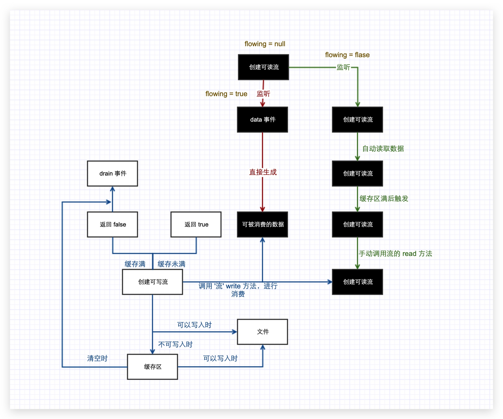

---
nav:
  title: 系统
  order: 3
group:
  title: 异步 I/O
  order: 2
title: ReadableStream 可读流
order: 4
---

# 可读流

可读流（Readable Streams）是对提供数据的源头（source）的抽象。

在 Node.js 中属于可读流的具体实现形式：

- 客户端的 HTTP 响应
- 服务端的 HTTP 请求
- `fs` 模块的 read streams 读取流
- `zlib` 压缩流
- `crypto` 加密流
- TCP Sockets
- 子进程 stdout 与 stderr 子进程标准输出和错误输出
- process.stdin 标准输入

所有的 Readable 都实现了 `stream.Readable` 类定义的接口。

```js
const Readable = stream.Readable;
```

实现了 `stream.Readable` 接口的对象，将对象的数据读取为流数据，当监听 `data` 事件后，开始发射（emit）数据。

🌰 **示例：读取文件流创建**

```js
const rs = fs.createReadStream(path, {
    // 打开文件要做的操作，默认 'r'
    flags: 'r',
    encoding: null,
    // 开始读取的索引位置
    start: '0',
    // 结束读取的索引位置（包括结束位置）
    end: '',
    // 读取缓存区默认的大小的阀值 64KB（水位线）
    highWaterMark: ''
})

// 监听 data 事件，流自动切换到流动模式
// 数据会尽可能快地读出
rs.on('data', function(data){
    console.log(data);
});

// 数据读取完毕后触发 end 事件
rs.on('end', function(){
    consolel.log('读取完毕')
});

// 可读流打开事件
rs.on('open', function(){
    consolel.log('读取完毕')
});

// 可读流关闭事件
rs.on('close', function(er){
    console.log('')
})；

// 指定编码和上面创建流时的参数 encoding 意思相同
rs.setEncoding('utf8');

rs.on('data', function(data){
    // 可读流暂停读取
    rs.pause();
    console.log(data);
});

setTimeout(function(){
    // 可读流恢复读取
    rs.resume();
}, 2000);
```

## 读取模式

Readable Streams 存在两种模式**流动模式**（flowing mode）和**暂停模式**（paused mode），这两种模式决定了 chunk 数据流动的方式：**自动流动**和**手工流动**。

可读流对象 `stream.Readable` 中有一个维护状态的对象 `readable._readableState`，这里简称为 `state`。其中有一个标记，`state.flowing`，可用来判别流的模式。它有三种可能值：

- `true` 表示流动模式
- `false` 表示暂停模式
- `null` 初始状态

1. **流动模式**（flowing mode）：数据自动从系统底层读取，形成**流动**现象，并通过事件，尽可能快地提供给应用程序。监听流的 `data` 事件便可进入该模式
2. **暂停模式**（paused mode）：需要显式地调用 `stream.readable.read` 方法，触发 `data` 事件以消耗流数据。

那么如何触发或相互转化这两种模式呢：

- **可读流都开始于暂停模式**

- **暂停模式切换到流动模式（flowing）**
  - 监听 `data` 事件
  - 调用 `stream.resume` 方法
  - 调用 `stream.pipe` 方法将数据发送到 Writable
- **流动模式切换到暂停模式（paused）**
  - 移除 `data` 事件
  - 如果没有管道目标，调用 `stream.pause` 方法
  - 如果有管道目标，调用 `stream.unpipe` 移除多个管道目标，并取消 `data` 事件监听

如果 `stream.Readable` 切换到 flowing 模式，且没有消费者处理流中的数据，这些数据将会丢失。比如，调用了 `readable.resume()` 方法切没有监听 `data` 事件，或是取消 `data` 事件监听，就有可能出现这种情况。

可以想象家用热水器的模型，热水器的水箱（Buffer 缓存区）里面存储着热水（数据），在我们用热水的时候，开启水龙头，自来水会不断地进入水箱，再从水箱由水龙头流出来供我们使用。这就是进入了 flowing 模式。当我们关闭水龙头的时候，水箱则会暂停进水，水龙头也会暂停出水，这就是 paused 模式。

<!--  -->

默认情况下我们在创建流对象之后它会处于暂停模式。

在暂停模式下，我们必须显式调用 `stream.readable.read` 方法来从流中读取数据片段，而流动模式下数据就会不断地被读出，当然这里要注意的是流动模式下数据并不是直接流向至应用，背后其实还存在一个缓存池，而池的大小是在我们创建读流对象时定义的，每次读取时最多读取的字节数不会超过池的大小，打个比方，如果有 9 个字节要读取，池的大小为 3 字节，那么就会分三次读入，在流动模式下，可以调用 `pause` 方法回到暂停模式，`resume` 方法再次回到流动模式。

在暂停模式中，我们可以监听 `readable` 事件，它将会在流有数据可供读取时触发，但是这不是一个自动读取的过程，它需要我们自己去调用 `read` 方法来读取数据，在监听这个事件时，默认会将缓存区先填满一次，每当缓存区读完时，这个 `readable` 事件就会再被触发，并且每次调用 `read` 方法时都会去检测一次缓存区的长度是否小于水口（HighWaterMark）大小，如果小于的话再读取一段水口大小的数据放入缓存区中。另外要注意一点的事有时候我们调用 `read` 时读取的大小可能会超过缓存区的大小，这个时候默认就会更改缓存区的大小到一个适合现在读取量的大小，然后再重新出发 `readable` 事件。

### 流动模式

```js
const fs = require('fs');
const path = require('path');
const rs = fs.createReadStream(path.join(__dirname, './1.txt'));

rs.setEncoding('utf8');

rs.on('data', data => {
  console.log(data);
});
```

### 暂停模式

```js
const fs = require('fs');
const path = require('path');
const rs = fs.createReadStream(path.join(__dirname, './index.txt'));

rs.setEncoding('utf8');

rs.on('readable', () => {
  let res = rs.read();
  console.log('res');
});
```

## 实现原理

创建可读流时，需要集成 Readable 对象，并实现 `_read` 方法。


`_read` 方法是从底层系统读取具体数据的逻辑，即生产数据的逻辑。

在 `_read` 方法中，通过调用 `push(data)` 将数据放入可读流中供下游消耗。在 `_read` 方法中，可以同步调用 `push(data)`，也可以异步调用。当全部数据都生产出来后，必须调用 `push(null)` 来结束可读流。流一旦结束，便不能再调用 `push(data)` 添加数据。可以通过监听 `data` 事件的方式消耗可读流。

在首次监听其 `data` 事件后，readable 便会持续不断地调用 `_read()`，通过触发 `data` 事件将数据输出。第一次 `data` 事件会在下一个 tick 中触发，所以，可以安全地将数据输出前的逻辑放在事件监听后（同一个 tick 中）。当数据全部被消耗时，会触发 `end` 事件。


通过流读取数据

- 使用 Readable 构造函数创建实例对象 readable 后，便得到了一个可读流
- 如果实现 `_read` 方法，就将流连接到一个底层数据源
- 流通过调用 `_read` 向底层请求数据，底层再调用流的 `push` 方法将需要的数据传递过来
- 当 readable 连接了数据源后，下游便可以调用 `readable.read(n)` 向流请求数据，同时监听 readable 的 `data` 事件来接收取到的数据

### doRead

流中维护了一个缓存，当缓存中的数据足够多时，调用 `read()` 不会引起 `_read()` 的调用，即不需要向底层请求数据。用 `doRead` 来表示 `read(n)` 是否需要向底层取数据。

```js
const doRead = state.needReadable;

if (state.length === 0 || state.length - n < state.highWaterMark) {
  doRead = true;
}

if (state.ended || statte.reading) {
  doRead = false;
}

if (doRead) {
  satte.reading = true;
  state.sync = true;
  if (state.length === 0) {
    state.needReadable = true;
  }
  this._read(state.highWaterMark);
  state.sync = false;
}
```

当缓存区的长度为 0 或者缓存区的数量小于 `state.highWaterMark` 这个阀值，则会调用 `_read()` 去底层读取数据。`state.reading` 标志上次从底层取数据的操作是否完成，一旦 `push` 被调用，就会就会设置 `false`，表示此次 `_read()` 结束。

### push

消耗方调用 `read(n)` 促使流输出数据，而流通过 `_read()` 使底层调用 `push()` 方法将数据传给流。如果调用 `push` 方法时缓存为空，则当前数据即为下一个需要的数据。这个数据可能先添加到缓存中，也可能直接输出。执行 `read` 方法时，在调用 `_read` 后，如果从缓存中取到了数据，就以 `data` 事件输出。

所以，如果 `_read` 异步调用 `push` 时发现缓存为空，则意味着当前数据是下一个需要的数据，且不会被 `read` 方法输出，应当在 `push` 方法中立即以 `data` 事件输出。

```js
state.flowing && state.length === 0 && !state.sync;
```

### end

由于流是分次向底层请求数据的，需要底层显示地告诉流数据是否取完。所以，当某次（执行 `_read()`）取数据时，调用了 `push(null)`，就意味着底层数据取完。此时，流会设置 `state.ended`。

`state.length` 表示缓存中当前的数据量。只有当 `state.length` 为 0，且 `state.ended` 为 `true`，才意味着所有的是数据都被消耗了。一旦在执行 `read(n)` 时检测到这个条件，便会触发 `end` 事件。当然，这个事件只会触发一次。

### readable

在调用完 `_read()` 后，`read(n)` 会试着从缓存中取数据。如果 `_read()` 是异步调用 `push()` 方法的，则此时缓存中的数据量不会增多，容易出现数据量不够的现象。

如果 `read(n)` 的返回值为 `null`，说明这次未能从缓存中取出所需量的数据。此时，消耗方需要等待新的数据到达后再次尝试调用 `read` 方法。

在数据到达后，流是通过 readable 事件来通知消耗方。在此种情况下，`push` 方法如果立即输出数据，接收方直接监听 `data` 事件即可，否则数据被添加到缓存中，需要触发 readable 事件。消耗方必须监听这个事件，再调用 `read` 方法取得数据。

## 实现过程

### 流动模式原理

🌰 **示例：可读流的流动模式原理代码实现过程**

从 Node.js 官方文档可知，流继承自 EventEmitter 模块，然后我们定义一些默认参数、缓存区、模式等。

```js
const fs = require('fs');
const EventEmitter = require('events');

class ReadableStream extends EventEmitter {
  constructor(path, options = {}) {
    super();
    this.path = path;
    this.highWaterMark = options.highWaterMark || 64 * 1024;
    this.flags = options.flags || 'r';
    this.start = options.start || 0;
    // 会随着读取的位置改变
    this.pos = this.start;
    this.autoClose = options.autoClose || true;
    this.end = options.end || null;
    // 默认 null 就是 Buffer
    this.encoding = options.encoding || null;

    // 参数的问题
   	// 非流动模式
    this.flowing = null;
    // 创建 Buffer 用于存储每次读出的数据
    this.buffer = Buffer.alloc(this.highWaterMark);

    // 打开这个文件
    this.open();

    // 此方法默认同步调用，每次设置 on 监听事件时都会调用之前所有的 newListener 事件
    this.on('newListener', (type) => {
      if (type === 'data') {
        // 相当于用户监听了 data 事件
        this.fllowing = true;
        // 开始读取，客户已经监听的 data 事件
        this.read();
      }
    })
  }

  // 用于打开文件的方法
  open() {
    // fd 表示的就是当前 this.path 的这个文件，从 3 开始（number 类型）
    fs.open（this.path, this.flags, (err, fd) => {
      // 有可能 fd 这个文件不存在，需要做处理
      if (err) {
        // 如果有自动关闭，则帮他销毁
        if (this.autoClose) {
          // 销毁（关闭文件，触发关闭文件事件）
          this.destroy();
        }
        // 如果有错误，就会触发 error 事件
        this.emit('error', err);
        return;
      }
    }）
  }

  // 用于在文件操作出错或读完之后关闭文件
  destory() {
    // 先判断有没有 fd 有关闭文件，触发 close 事件
    if (typeof this.fd !== 'number') {
      return this.emit('close');
    }
    // 如果文件被打开过，就关闭文件并且触发 close 事件
    fs.close(this.fd, () => {
      // 销毁
      this.emit('close');
    })
  }

  // 默认第一次调用 read 方法时 fd 还没获得，所以不能直接读
  read() {
    // 此时文件还没打开
    if (typeof this.fd !== 'number') {
      // 当文件真正打开的时候，会触发 open 事件，触发事件后再执行 read，此时 fd 肯定拿到了
      return this.once('open', () => this.read())
    }

    // 每次读的时候都要判断一下下次读几个，如果没有 end 就根据 highWaterMark 来（读所有的）
    // 如果有且大于 highWaterMark 就根据 highWaterMark 来
    // 如果小于 highWaterMark 就根据 end 来
    let howMuchToRead = this.end ? Math.min(this.end - this.pos + 1, this.highWaterMark) : this.highWaterMark;
    fs.read(this.fd, this.buffer, 0, howMuchToRead, this.pos, (err, byteRead) => {
      this.pos += byteRead;
      let b = this.encoding ? this.buffer.slice(0, byteRead).toString(this.encoding) : this.buffer.slice(0, byteRead);
      this.emit('data', b);
      // 如果读取到的数量和 highWaterMark 一样，说明还得继续读
      if ((byteRead === this.highWaterMark) && this.flowing) {
        this.read();
      }
      if (byteRead < this.highWaterMark) {
        this.emit('end');
        this.destroy();
      }
    })
  }

  pause() {
    this.flowing = false;
  }

  resume() {
    this.flowing = true;
    this.read();
  }
}
```

### 暂停模式原理

以上是流动模式的可读流实现原理，暂停模式的可读流原理与流动模式的主要区别在于监听 `readable` 事件的绑定与 `read` 方法，先实现监听绑定 `readable` 事件回调函数时，调用 `read` 方法读取数据到缓存区，定义一个读取方法 `_read`。

```js
constructor(path, options) {
  super();
  this.path = path;
  this.highWaterMark = options.highWaterMark || 64 * 1024;
  this.autoClose = options.autoClose || true;
  this.start = 0;
  this.end = options.end;
  this.flags = options.flags || 'r';

  // 缓存区
  this.buffers = [];
  this.pos = this.start;
  // 缓存区大小
  this.length = 0;
  this.emittedReadable = false;
  // 不是正在读取的
  this.reading = false;

  this.open();

  this.on('newListener', function (eventName) {
    if (eventName === 'readable') {
      this.read();
    }
  })
}

read(n) {
  if (this.length === 0) {
    this.emittedReadable = true;
  }
  if (this.length < this.highWaterMark) {
    if (!this.reading) {
      this.reading = true;
      this._read();
    }
  }
}

_read() {
  if (typeof this.fd !== 'number') {
    return this.once('open', () => this._read());
  }
  let buffer = Buffer.alloc(this.highWaterMark);
  fs.read(this.fd, buffer, 0, buffer.length, this.pos, (err, bytesRead) => {
    if (bytesRead > 0) {
      this.buffers.push(buffer.slice(0, bytesRead));
      this.pos += bytesRead;
      this.length += bytesRead;
      this.reading = false;
      if (this.emittedReadable) {
        this.emiitedReadable = false;
        this.emit('readable');
      }
    } else {
      this.emit('end');
      this.destroy();
    }
  })
}
```

由 API 可知，暂停模式下的可读流手动调用 `read` 方法参数可以大于 highWaterMark，为了处理这种情况，我们先写一个函数 `computeNewHighWaterMark`，取到大于等于 `n` 的最小 2 的 n 次方的整数。

```js
function computeNewHighWaterMark(n) {
  n--;
  n |= n >>> 1;
  n |= n >>> 2;
  n |= n >>> 4;
  n |= n >>> 8;
  n |= n >>> 16;
  n++;
  return n;
}
```

然后写 `read` 方法，要考虑全 n 的各种情况：

```js
read(n) {
  if (n > this.length) {
    // 更改缓存区大小，读取五个就找 2 的几次放最近的
    this.highWaterMark = computeNewHighMark(n);
    this.emiitedReadable = true;
    this._read();
  }

  // 如果 n > 0 就从缓存区中获取
  let buffer = null;
  // 维护 Buffer 的索引的
  let index = 0;
  let flag = true;
  if (n > 0 && n <= this.length) { // 读取内容，缓存区中有这么多
    // 在缓存区中取 [[2, 3], [4, 5, 6]]

    // 这是要返回的 Buffer
    buffer = Buffer.alloc(n);
    let buf;
    while(flag && (buf = this.buffers.shift())) {
      for(let i = 0; i < buf.length; i++){
        buffer[index++] = buf[i];
        // 拷贝够了，不需要再拷贝了
        if (index === n) {
          flag = false;
          this.length -= n;
          // 取出留下的部分
          let bufferArr = buf.slice(i+1);
          // 如果有剩下的内容，再放入缓存中
          if (bufferArr.length > 0) {
            this.buffers.unshift(bufferArr);
          }
          break;
        }
      }
    }
  }
  // 当前缓存区，小于 highWaterMark 时再去读取
  if (this.length === 0){
    this.emittedReadable = true;
  }
  if (this.length < this.highWaterMark) {
    if (!this.reading) {
      this.reading = true;
      // 异步的
      this._read();
    }
  }
  return buffer;
}
```

### Readable

`readable` 这个方法是可读流的一种暂停模式，他的模式可以参考为可读流是往水杯倒水的人， Readable 是喝水的人，他们之间存在着一种联系，只要 Readable 喝掉一点水，可读流就会继续往里倒。

- Readable 会在刚开始监听 Readable 的时候就触发流，此时流就会读取一次数据，之后流会监听，如果有人读过流（喝过水），并且减少，就会再去读一次（倒点水）
- Readable 主要用来做行读取器（LineReader）

```js
const fs = require('fs');
const read = require('./ReadableStream');
const rs = fs.createReadStream('./readStream.txt', {
  // 每次读 7 个
  highWaterMark: 7,
});

// 如果可读流第一次全部读下来并且小于 highWaterMark，就会再读一次（再触发一次 readable 事件）
// 如果 rs.read() 不加参数，一次性读完，会从缓存区再读一次，为 null
// 如果 readable 每次都刚好读完（即 rs.read() 的参数刚好和 highWaterMark 相等），就会一直触发 readable 事件，如果最后不足读取的数，就会先触发一次 null，最后吧剩下的读完
// 一开始缓存区为 0 的时候
rs.on('readable', () => {
  let result = rs.read(2);
  console.log(result);
});
```

实战：行读取器（平常我们的文件可能有回车、换行，此时如果要每次想读一行的数据，就得用到 `readable`）

```js
const EventEmitter = require('events');
// 如果要将内容全部读出就用 on('data')，精确读取就用 on('readable')
class LineReader extends EventEmitter {
  construtor(path) {
    super();
    this.rs = fs.createReadStream(path);
    // 回车符的十六进制
    const RETURN = 0x0d;
    // 换行符的十六进制
    const LINE = 0x0a;
    let arr = [];
    this.on('newListener', type => {
      if (type === 'newLine') {
        this.rs.on('readable', () => {
          let char;
          // 每次读一次，当读完的时候会返回 null，终止循环
          while ((char = this.rs.read(1))) {
            switch (char[0]) {
              case RETURN:
                break;
              // Mac 下只有换行符，windows 下是回车符和换行符，需要根据不同的转换
              case LINE:
                // 如果是换行符就把数组转换为字符串
                let r = Buffer.from(arr).toString('utf8');
                // 把数组清空
                arr.length = 0;
                // 触发 newLine 事件，把得到的一行数据输出
                this.emit('newLine', r);
                break;
              default:
                // 如果不是换行符，就放入数组中
                arr.push(char[0]);
            }
          }
        });
      }
    });
    // 以上只能取出之前的换行符前的代码，最后一行的后面没有换行符，所以需要特殊处理，当可读流读完需要触发 end 事件时
    this.rs.on('end', () => {
      // 取出最后一行数据，转成字符串
      let r = Buffer.from(arr).toString('utf8');
      arr.length = 0;
      this.emit('newLine', r);
    });
  }
}

let lineReader = new LineReader('./index.txt');
lineReader.on('newLine', function(data) {
  console.log(data);
});
```

### 自定义可读流

由于 `createReadStream` 内部调用了 ReadStream 类，ReadStream 又实现了 Readable 接口，ReadStream 实现了 `_read()` 方法，所以我们通过自定义一个累继承 `stream` 模块的 Readable，并在原型上自定义自己的可读流。

```js
const { Readable } = require('stream');

class MyRead extends Readable {
  // 流需要一个 _read 方法，方法中 push 什么，外面就接收什么
  _read() {
    // push 方法就是上面 _read 方法中的 push 一样，把数据放入缓存区中
    this.push('100');
    // 如果 push 了 null 就表示没有东西可读了，停止（如果不写，就会一直 push 上面的值，死循环）
    this.push(null);
  }
}
```

## 运行全流程



如上图，当我们创建一个可读流的时候，`readable._readableState.flowing` 属性默认为 `null`，这时我们有两种选择：

1. 监听 `readable` 事件，这是可读流会读取 64 KB（可以在创建可读流时，通过 `option` 参数重的 highWaterMark 更改）数据到流的缓存区中，等待你用 `read` 方法取读取并消费数据，当你用 `read` 方法读了 64KB 数据之后，会再次出发 `readable` 事件，知道你读完了源文件的所有数据。记住，之所以叫暂停模式是因为如果你不调用 `read` 方法，代码永远会停在这里，什么事情也不会发生。
2. 如果你选择监听 `data` 事件，可读流会直接读取 64KB 数据并通过 `data` 事件的回调函数提供给你消费，并且这个过程不会停止，如果源文件中有很多数据，会不停的触发 `data` 事件，知道全部读取完成。当然，在这个过程中你随时可以通过 `stream.pause()` 方法暂停它。

那么，这两种模式有什么区别呢？在我理解，如果你不需要对数据进行精确控制，首先选择**流动模式**，因为它的效率更高。如果需要对流的过程进行精确控制则可以选择**暂停模式**。也就是说暂停模式是流更高级一些的用法。其实官方建议我们尽量不要手动去操作流，如果可以，尽量使用 `pipe` 方法。

接下来，不论我们以哪种方式读到了文件中的数据，这时我们都可以创建一个可写流并调用可写流的 `write` 方法来消费读到的数据。调用 `write` 方法会向文件中写入数据，但是因为写入的速度较慢，如果当前写入还在进行，而你又调用了 `write` 方法，Node.js 会将你要写入的数据缓存在一个缓存区中，等到文件写入完毕会从缓存区中取出数据，继续写入。

`write` 方法拥有一个布尔类型的返回值，用来表示目前是否还可以继续调用 `write` 方法写入内容。如果返回 `false`，我们应当停止读取数据以避免消耗过多内存。那么什么时候会返 `false` 呢？就是当缓存区的大小大于 16KB（可以在创建可读流时，通过 `option` 参数中的 `highWaterMark` 更改）时。

缓存区满后，文件写入一直在进行，不一会儿会把缓存区的内容全部写入，缓存区处于清空状态，这时会触发可写流的 `drain` 事件，这时我们可以继续向文件写入数据了。注意：如果缓存区从未满过，`drain` 事件永远也不会触发。
